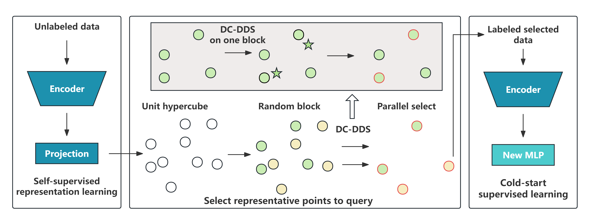

# **SEAGULL:  Subsampling Assisted Active Learning Without Initial Labeled data**

This repository provides an implement of **S**ubsampling assist**E**d **A**ctive learnin**G** without initia**L** **L**abeled data (**SEAGULL**). 

**SEAGULL** includes the three main steps:

* Self-supervised representation learning. 
* Select representative points to query. 
* Cold-start supervised learning.



## Requirement

Built Using Languages and Libraries Listed Below  

* [Python](https://docs.python.org/3/)
* [R](https://cran.r-project.org/mirrors.html)
* [numpy](https://numpy.org/devdocs/)
* [PyTorch]([PyTorch](https://pytorch.org/))
* [Pandas]([pandas - Python Data Analysis Library (pydata.org)](https://pandas.pydata.org/))
* [UniDOE (R package)](https://cran.r-project.org/src/contrib/Archive/UniDOE/)
* SPlit (R package)
* numbers (R package)

Or in tabular form

| Environment         | version |
| ------------------- | :-----: |
| Python              |  3.10   |
| R                   |  4.4.2  |
| numpy               | 1.23.5  |
| PyTorch             |  2.0.1  |
| torchvision         | 0.18.0  |
| UniDOE (R package)  |  1.0.2  |
| SPlit (R package)   |   1.2   |
| numbers (R package) |  0.8-5  |


## Usage

Here, we give an example on Cifar10 with [MoCo v2](https://github.com/facebookresearch/moco). (SimCLR pytorch implement refer to this [repository](https://github.com/sthalles/SimCLR).

1. **Train self-supervised model with unlabeled data.** Here we choose resnet18 as the basic encoder. The meaning of parameters are the same with [MoCo v2](https://github.com/facebookresearch/moco). Note that thee out dimension of MoCo here is 16 instead of 128.

```python
python main_moco.py -a resnet18 --lr 0.015 --batch-size 128 --epochs 512  --dist-url 'tcp://localhost:10001' --world-size 1 --rank 0 --moco-dim 16 --moco-t 0.05 --moco-k 65536 --mlp --aug-plus --cos /data/cifar
```

2. Use DC-DDS choose the representative data to query. Run example_dcdds in R. More details, run the following codes.

```R
path = "feature/resnet50_moco_cifar10_feature.txt" # your feature path
# b: number of block, m: subset in one block, b * m = n.
# seed: random seed, dim: PCA reduced dimension.
m = 25
b = 20
dim = 5
seed = 100
data = read.table(path)
selected_data = seq_DDS_givendim(data, m, b, dim, seed)
write.csv(selected_data, paste("r/cifar", dim, m, b, "indices.csv", sep = "_"),row.names = F) # indices path
```

3. 

```python
python main_lincls.py -a resnet50 --lr 0.0005 --batch-size 32 --epochs 50 --pretrained checkpoint_best_16.pth.tar --dist-url 'tcp://localhost:10001' --world-size 1 --rank 0 --subsetsize 500 --seed 777 --learning-mode active --active-indices r/imagenet_16_greedyk500_2indices.csv data/tiny-imagenet-200
```

​	

## Details


## Results

Train loss and test loss on Cifar10.

